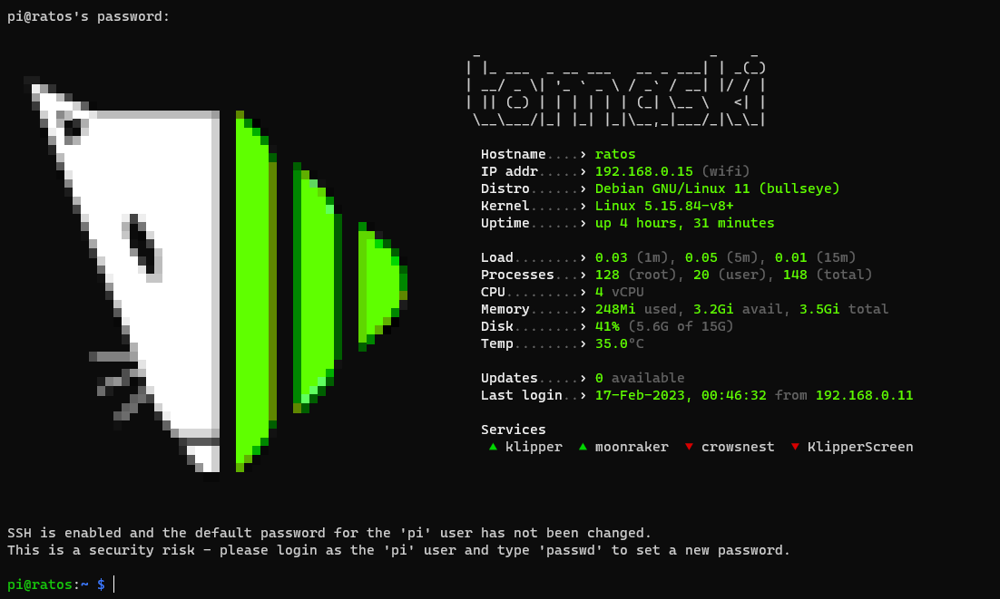
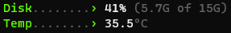
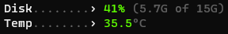

<div align="center">

# Klipper MoTD

[](https://github.com/tomaski/klipper-motd/releases)
[](https://github.com/tomaski/klipper-motd/blob/main/LICENSE)
[](http://makeapullrequest.com)

`klipper-motd` is configurable and theme-able Message of The Day for Klipper with installer and configurator.

[The Why](#why)  •
[The How](#getting-started)  •
[FAQ](#faq)  •
[Contribute](#want-to-contribute)



</div>

## The Why

As I SSH into my printers quite frequently, I got bored with the standard, generic, wall-of-text MoTD (Message of The Day) where only relevant information displayed was `Last login` (one line out of 9) and wanted to give my printers a bit more flair. While at it, I thought it'd be even cooler if I make it more flexible and reusable on different Klipper flavors.

## The How (a.k.a. Getting Started)

### Installation

First, SSH into your Raspberry and download this reposiitory
```bash
git clone https://www.github.com/tomaski/klipper-motd.git
```

Installation is done by making the `setup.sh` executable and running it with proper flag
```bash
chmod +x ./klipper-motd/setup.sh
sudo ./klipper-motd/setup.sh --install
```

After that it's just a matter of running the configurator, where you can adjust the MoTD to your liking
```bash
sudo motd-config
```


### Configuration
#### Theme (flavor)
Is pretty self explanatory: each has its own icon anc accent color

#### Available variants
Variant  1 (labels)



Variant 2 (values, default)



#### Highlighted updates

Turned on (default)

If OS updates count is 0, it'll use `variant` settings. For values greater than 0 will use highlight (orange) color


Turned off

Will always use the `variant` settings.

### Removal
If you no longer wish to use this MoTD simply run `setup.sh` command with `--remove` flag and the script will remove all `klipper-motd` files from your system and revert any changes made during installation.
```bash
sudo ./klipper-motd/setup.sh --remove
```
after that, remove the `klipper-motd` directory
```bash
rm -rf ./klipper-motd/
```

## FAQ
### Q: Why are the logos so blurry/pixelated?
Keep in mind that terminal is, in it's entirety, text based. Being able to produce images in it requires some very complex wizardry and AFAIK this is as good as it gets.

### Q: How to add or change services?
Currently, the configurator does not support editing services list, so if you wish to make adjustments, you'd need to do it manually.

> **Warning**
> service names are case sensitive! 
> Run `systemctl list-units --type=service` to see which services are known to the system and what their names are. You need to use that name (without `.service`)
```bash
sudo nano /etc/motd.update.d/10-klipper-motd
```

The services to be displayed are stored here
> **Warning**
> names must be in double quotes and the space between elements is mandatory
```bash
SERVICES=("klipper" "moonraker" "crowsnest" "KlipperScreen")
```
`Ctrl`+`o` to save. Then `Enter` to confirm and `Ctrl`+`x` to exit.

### Q: How to edit colors?
Editing colors is also not supported in configurator, so in order to tweak the theme to your liking, you'd need to make manual edits
```bash
sudo nano /etc/motd.update.d/10-klipper-motd
```
the color definitions used, are clearly described inside this file. This link might come in handy for color codes [bash colors cheat sheet](https://www.ditig.com/256-colors-cheat-sheet)

### Q: How to add more logos?
First of all, you need [util-say](https://github.com/maandree/util-say) which needs OpenJDK (as util-say is Java based) version 6 and 7 - but Raspberry OS based system nowadays come with versions 11 and 17. So you'd either need older Linux distribution (Ubuntu 18.04 is confirmed to be working) or find a way to install v6 (I won't be covering it). Then it's matter of installing needed packages
```bash
sudo apt-get install imagemagick openjdk-6-jdk coreutils perl
```
and downloading the `util-say`
```bash
git clone https://github.com/maandree/util-say
cd util-say
make
```
then just download your image
```bash
wget URL_OF_YOUR_PICTURE -O myimage.png
```
and convert it to text-based representation
```bash
./ponytool --import image --magnified 20 --file myimage.png --balloon n --export ponysay --platform xterm --chroma 1 --right 0 --left 0 --top 0 --bottom 0 > converted_image
```
the text-based image will be saved to `converted_image` file. To view it, simply type
```bash
cat converted_image
```
If the size is wrong, you need to adjust the `--magnified` parameter. For images that are 1024px x 1024px the magnification of about `20` is good starting point. Smaller image sizes need lower magnification value.

## Want to contribute?
Contributions are always welcome! Please have a look at the awesome tutorial [How to Contribute to an Open Source Project on GitHub](https://kcd.im/pull-request)

## Credits
`klipper-motd` is heavily inspired by [Street Fighter MOTD](https://github.com/ajgon/street-fighter-motd) by Igor Rzegocki for its picture section and [Fancy MOTD](https://github.com/bcyran/fancy-motd) by Bazyli Cyran for the sysinfo section.

## License
`klipper-motd` is free and open-source software licensed under the [MIT license](LICENSE.md)